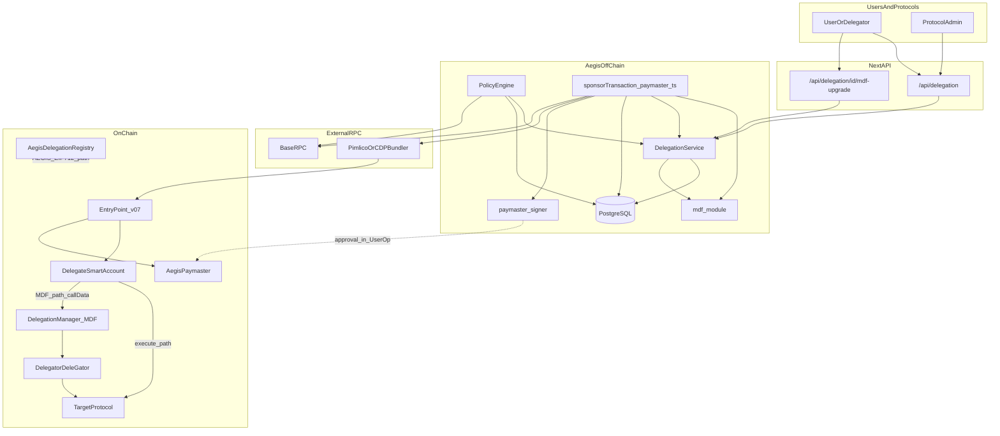

# Aegis — Architecture and Composability Map

**Audience:** Engineers maintaining and extending the Aegis agent, sponsorship, and delegation systems.  
**Scope:** Codebase as of documentation date (`aegis-agent/` tree). Prefer this document plus source files over stale assumptions.  
**Related docs:** [AEGIS_SPONSORSHIP_ARCHITECTURE.md](./AEGIS_SPONSORSHIP_ARCHITECTURE.md), [CLAUDE.md](../CLAUDE.md), [README.md](../README.md), [CODEBASE_UPDATES.md](../CODEBASE_UPDATES.md).

---

## 1. Executive architecture summary

### What Aegis is

Aegis is an **ERC-4337-oriented execution and gas sponsorship system** for autonomous agents. It combines:

- **Off-chain reasoning and policy** (LLM / decision objects, configurable safety rules).
- **Sovereign paymaster** (`AegisPaymaster.sol`) — backend ECDSA approval over `UserOperation` fields (including `callData` hash).
- **Bundler integration** — primarily **Pimlico** via JSON-RPC (`eth_estimateUserOperationGas`, `eth_sendUserOperation`, `eth_getUserOperationReceipt`); optional **Coinbase CDP** bundler when `BUNDLER_PROVIDER=coinbase`.
- **User-to-agent delegation** — two modes:
  - **AEGIS path:** EIP-712 signed permissions against `AegisDelegationRegistry`; scope, value, expiry, and per-delegation gas budget enforced **off-chain** in policy + DB.
  - **MDF path (MetaMask Delegation Framework):** after **MDF upgrade**, `UserOp.callData` calls external **`DelegationManager.redeemDelegations`**, with **caveat enforcers** enforcing authorization **on-chain**; Aegis still sponsors gas via the same paymaster.

### Problem it solves

Protocols and users want **agents to transact on-chain** without the agent holding user keys, while **limiting blast radius** (policy + budgets + optional on-chain caveats) and **paying gas** through a controlled paymaster.

### What changed with MDF integration

- New module **`src/lib/mdf/`** — types, DelegationManager ABI slice, caveat builders from `DelegationPermissions`, EIP-712 verification for MDF `Delegation` struct, `buildRedeemDelegationsCalldata`.
- **Prisma `Delegation`** gains: `mdfDelegationHash`, `serializedMdfDelegation`, `delegationManagerAddress`, `delegatorAccountType` (`DELEGATOR` | `EOA` | `UNKNOWN`).
- **API:** `POST /api/delegation/[delegationId]/mdf-upgrade` attaches the signed MDF struct to an existing Aegis delegation.
- **`src/lib/agent/execute/paymaster.ts`** — if `delegationId` resolves to `delegatorAccountType === DELEGATOR` and serialized MDF exists, builds **`redeemDelegations`** calldata instead of `execute(target,value,data)`; **skips `deductDelegationBudget`** on success for MDF (caveats supersede off-chain gas budget).
- **`src/lib/agent/policy/delegation-rules.ts`** — four rules **skipped** on MDF path (scope/value/expiry/budget); **`mdf-delegation-revocation-check`** calls `DelegationManager.isDelegationDisabled` via RPC when `MDF_ENABLED=true`.

### Composable shape (mental model)

```text
[User / Protocol] → [Delegation API + optional MDF upgrade]
                         ↓
[Decision + SponsorParams incl. delegationId?] → [Policy engine] → [sponsorTransaction]
                         ↓
[Calldata: execute(...) OR redeemDelegations(...)] → [preparePaymasterSponsorship: estimate + signPaymasterApproval]
                         ↓
[Bundler] → [EntryPoint] → [Account.validateUserOp + execute] + [Paymaster.validatePaymasterUserOp]
                         ↓
[Target contracts] + [logs / DB / usage records]
```

**MDF** is an **authorization adapter** for `callData`. **AegisPaymaster** remains **calldata-agnostic** (signs over the UserOp’s `callData` commitment).

---

## 2. Full component inventory

For each area: **purpose**, **inputs**, **outputs**, **dependencies**, **dependents**, **role tag** (`core` | `adapter` | `legacy` | `optional`).

### 2.1 MetaMask Delegation Framework (MDF) — `src/lib/mdf/`

| File | Purpose | Inputs | Outputs | Dependencies | Dependents | Role |
|------|---------|--------|---------|--------------|------------|------|
| `types.ts` | `MdfDelegation`, `MdfCaveat`, execution mode constant, result types | N/A | Types/constants | viem types | caveats, verifier, calldata, service | **core** (MDF path) |
| `constants.ts` | `DELEGATION_MANAGER_ADDRESSES`, `DELEGATION_MANAGER_ABI` (redeemDelegations, isDelegationDisabled), `CAVEAT_ENFORCERS_BASE_SEPOLIA`, resolvers | Env: `MDF_*`, `AGENT_NETWORK_ID` | Addresses, ABI | process.env | caveats, delegation-rules, mdf-upgrade route | **adapter** |
| `caveats.ts` | Map `DelegationPermissions` → `MdfCaveat[]` (AllowedTargets, AllowedMethods, Timestamp, ValueLte, …) | Permissions + dates | Caveat array | viem, `constants`, delegation schemas | Used when building client-side / doc flows; builders available for parity with permissions | **adapter** |
| `verifier.ts` | EIP-712 verify MDF delegation (domain `DelegationManager`); `hashMdfDelegation` | Struct + manager address + chainId | valid/error; hash | viem | `delegation/service.createMdfDelegation`, policy revocation | **core** (MDF path) |
| `calldata.ts` | ABI-encode delegation for `permissionContexts`; build `redeemDelegations` calldata; serialize/deserialize for DB | `MdfDelegation`, target, value, inner calldata | `callData`, `delegationHash` (local helper) | viem, constants | `userop-calldata.buildMdfCalldata`, tests | **core** (MDF path) |
| `index.ts` | Public exports | N/A | Re-exports | submodules | delegation service, paymaster, policy, API | **core** |

### 2.2 Delegation domain — `src/lib/delegation/`

| File | Purpose | Inputs | Outputs | Dependencies | Dependents | Role |
|------|---------|--------|---------|--------------|------------|------|
| `service.ts` | CRUD: create (Aegis EIP-712), revoke, list, validate for tx, budget deduct/rollback, usage recording; **`createMdfDelegation`** upgrade | API requests, DB | Results, formatted responses | Prisma, logger, config, eip712, **mdf** | API routes, paymaster, policy | **core** |
| `schemas.ts` | Zod: permissions, create/list/revoke, **MdfDelegationUpgradeRequestSchema** | JSON | Parsed types | zod | API, service, policy helpers | **core** |
| `eip712.ts` | Aegis delegation EIP-712 verify (registry contract) | Typed data + sig | Valid/invalid | viem, config | `createDelegation` | **core** (AEGIS path) |
| `index.ts` | Barrel exports | N/A | API surface for app code | service, schemas | API routes, agent policy, paymaster | **core** |

### 2.3 Execution and sponsorship — `src/lib/agent/execute/`

| File | Purpose | Inputs | Outputs | Dependencies | Dependents | Role |
|------|---------|--------|---------|--------------|------------|------|
| `paymaster.ts` | **Main sponsor path:** `signDecision`, `logSponsorshipOnchain`, `preparePaymasterSponsorship`, `executePaymasterSponsorship`, **`sponsorTransaction`** (IPFS, calldata, nonce, reserve, bundler, budget, delegation usage) | `Decision`, mode | `SponsorshipExecutionResult` | viem, keystore, bundler-client, paymaster-signer, budget, delegation, mdf, userop-calldata, prisma, cache, oracles, guarantees | `execute/index`, `agent/index`, queue-consumer, sponsor-executor, scripts | **core** |
| `paymaster-signer.ts` | Backend ECDSA for `AegisPaymaster` approval blob in `paymasterAndData` | sender, nonce, callData, tier, gas limits | `paymasterAndData`, hashes | viem, env keys | paymaster.ts, demos, tests | **core** |
| `userop-calldata.ts` | `buildExecuteCalldata` (account `execute`); **`buildMdfCalldata`** (dynamic require to mdf `buildRedeemDelegationsCalldata`) | Targets + inner data | Hex calldata | viem, mdf | paymaster | **core** |
| `bundler-client.ts` | Pimlico/CDP RPC: hex serialization of UserOp v0.7, gas estimate, submit, receipt wait, entry point address | UserOp, env URLs | Hashes, receipts | viem account-abstraction | paymaster, health checks | **adapter** (bundler) |
| `bundler/factory.ts` | `createBundler()` → `DefaultBundlerAdapter` | Env | `IBundler` | default-adapter | (extension point) | **adapter** |
| `bundler/default-adapter.ts` | Delegates to bundler-client | Same | Same | bundler-client | factory | **adapter** |
| `nonce-manager.ts` | `EntryPoint.getNonce(sender, key)` | Sender, RPC | Nonce bigint | viem, entry point from bundler-client | paymaster | **core** |
| `reserve-manager.ts` | (If present in tree) reserve flows for execution | Per codebase | Per codebase | budget/guarantees | paymaster | **core** / **optional** by feature |
| `index.ts` | Re-exports execution entrypoints | N/A | sponsorTransaction, etc. | paymaster | agent loop, queue | **core** |

### 2.4 Policy — `src/lib/agent/policy/`

| File | Purpose | Inputs | Outputs | Dependencies | Dependents | Role |
|------|---------|--------|---------|--------------|------------|------|
| `rules.ts` | Merges **sponsorship**, **reserve**, **delegation** rule arrays; validates decisions | Decision, AgentConfig | Pass/fail per rule | delegation-rules, sponsorship-rules, reserve-rules, state-store | agent index / queue | **core** |
| `delegation-rules.ts` | **7 rules:** exists, scope, value, expiry, budget, rate limit, **mdf-delegation-revocation-check**; MDF skips 4 via `isMdfDelegation()` + DB | Decision | RuleResult | prisma, delegation helpers, **mdf** constants/ABI, viem public client | rules.ts | **core** |
| `sponsorship-rules.ts` | Protocol onboarding, tier, whitelist, gas, confidence, etc. | Decision, config | RuleResult | prisma, cache, onboarding | rules.ts | **core** |
| `reserve-rules.ts` | Reserve-related policy | Decision | RuleResult | (domain deps) | rules.ts | **core** / **optional** by action |
| `rate-limit-utils.ts` | Post-success sponsorship rate accounting | Wallet, protocol | Side effects | cache/store | paymaster | **core** |
| Other policy files | Tier rules, skills, fail-closed, etc. | Per file | Per file | Per file | rules.ts or direct | **core** / **optional** |

### 2.5 Agent orchestration

| Location | Purpose | Role |
|----------|---------|------|
| `src/lib/agent/index.ts` | Main agent loop: observe → decide → **policy** → **sponsorTransaction** | **core** |
| `src/lib/agent/queue/queue-consumer.ts` | Async queue: validate → **sponsorTransaction** | **core** |
| `src/lib/executors/sponsor-executor.ts` | Executor wrapper for sponsorship | **adapter** |
| `src/lib/agent/reason/schemas.ts` | `Decision`, `SponsorParams` (includes optional `delegationId`, `targetContract`, …) | **core** |

### 2.6 API surfaces (Next.js App Router)

| Route | Purpose | Auth | Role |
|-------|---------|------|------|
| `app/api/delegation/route.ts` | POST create, GET list | Bearer `AEGIS_API_KEY` | **core** |
| `app/api/delegation/[delegationId]/route.ts` | GET one, DELETE revoke (delegator header per docs) | API key + delegator | **core** |
| `app/api/delegation/[delegationId]/usage/route.ts` | Usage history | API key | **core** |
| `app/api/delegation/[delegationId]/mdf-upgrade/route.ts` | **MDF upgrade** | API key | **core** (MDF) |
| `app/api/agent/[agentAddress]/delegations/route.ts` | List delegations for agent | API key | **core** |
| `app/api/agent/*` (cycle, status, register, …) | Agent operations | Varies | **core** / **optional** |
| `app/docs/*`, `app/delegation/*` | Documentation and UI | Varies | **optional** (product) |

### 2.7 Persistence — `prisma/`

| Artifact | Purpose | Role |
|----------|---------|------|
| `schema.prisma` | **Delegation** (+ MDF fields), **DelegationUsage**, **SponsorshipRecord**, **ProtocolSponsor**, **Agent**, **Execution**, **QueueItem**, guarantees, gas passport, etc. | **core** |
| `migrations/*.sql` | DDL history | **core** — see **risks** (drift) |

### 2.8 Configuration and infrastructure

| Location | Purpose | Role |
|----------|---------|------|
| `.env` / `.env.example` | RPC URLs, bundler URLs, paymaster keys, `MDF_*`, `DELEGATION_*`, `AEGIS_API_KEY`, etc. | **core** |
| `src/lib/config.ts` | Typed config getters | **core** |
| `src/lib/db.ts` | Prisma client | **core** |
| `src/lib/logger.ts` | Logging | **core** |
| `src/lib/auth/api-auth.ts` | API key verification | **core** |
| `src/lib/keystore.ts` | Agent signing account (activity logger, etc.) | **core** |
| `src/lib/ipfs.ts` | Decision upload | **optional** |

### 2.9 On-chain (in-repo contracts)

| Contract | Purpose | Role |
|----------|---------|------|
| `contracts/AegisPaymaster.sol` | Validates backend approval, sponsors UserOps | **core** |
| `contracts/AegisDelegationRegistry.sol` (and related) | On-chain delegation for **AEGIS** path (per CLAUDE) | **core** (AEGIS path) |
| Activity / attestation / observer contracts | Logging and observability | **optional** / **core** by deployment |
| **`DelegationManager` + enforcers** | **Not in repo** — MetaMask delegation-framework deployments | **external** |

### 2.10 Demos and scripts

| Script | Purpose | Role |
|--------|---------|------|
| `scripts/demo-e2e.ts` | Paymaster signing + UserOp hash demo | **demo** |
| `scripts/fund-paymaster.ts`, `deploy-paymaster.ts` | Ops | **demo** / **ops** |
| `scripts/run-*-campaign.ts` | Calls `sponsorTransaction` | **demo** / **ops** |

### 2.11 Tests (representative)

| Path | What it validates | Role |
|------|-------------------|------|
| `tests/mdf/calldata.test.ts` | Redeem calldata shape, serialization round-trip | **test** (MDF) |
| `tests/agent/policy/delegation-rules.test.ts` | Delegation policy rules (mocks delegation module) | **test** |
| `tests/agent/execute/paymaster-signer.test.ts` | Paymaster approval bytes layout | **test** |
| `tests/agent/paymaster.test.ts` | sponsorTransaction branches | **test** |
| `tests/agent/execute/bundler/default-adapter.test.ts` | Bundler adapter | **test** |
| `tests/integration/*` | End-to-end / phase tests | **test** |

---

## 3. Composability matrix

Summary table: **upstream** = this component needs; **downstream** = what consumes it.

| Component | Role in system | Upstream dependencies | Downstream consumers | On-chain / off-chain | Sync / async | MDF-related? | Status |
|-----------|----------------|------------------------|----------------------|----------------------|--------------|--------------|--------|
| `src/lib/mdf/*` | Authorization calldata + verify + hashes | Env addresses, viem | delegation service, paymaster, userop-calldata, policy | Off-chain build; effects on-chain at execution | Sync | Yes | **core** (MDF path) |
| `src/lib/delegation/service` | Delegation lifecycle + MDF upgrade | Prisma, mdf verifier | API, policy, paymaster | DB off-chain; registry/MDF on-chain | async (DB) | Partial | **core** |
| `src/lib/agent/policy/delegation-rules` | Delegation gates + MDF revocation RPC | Prisma, mdf ABI, RPC | rules.ts | Off-chain (+ read-only RPC) | async | Yes | **core** |
| `src/lib/agent/execute/paymaster` | Sponsor pipeline | Almost all execution stack | agent, queue, executors, scripts | Mixed | async | Dual-path | **core** |
| `paymaster-signer` | ECDSA sponsorship approval | Private key env | paymaster | N/A | Sync | No | **core** |
| `bundler-client` | Submit UserOp | Bundler URL, EntryPoint | paymaster | Off-chain RPC → on-chain inclusion | async | No | **adapter** |
| `AegisPaymaster.sol` | Validate + pay gas | EntryPoint flow | N/A (chain) | On-chain | Sync (per tx) | No (calldata-agnostic) | **core** |
| EntryPoint (canonical) | 4337 orchestration | Chain | Account + Paymaster | On-chain | Sync | No | **external** |
| Prisma / PostgreSQL | State | DATABASE_URL | Services | Off-chain | async | Stores MDF fields | **core** |
| Next API routes | HTTP surface | service layers | Clients | Off-chain | async | mdf-upgrade | **core** |

---

## 4. End-to-end request flows

### 4.1 Standard sponsorship flow (no delegation)

1. Decision `SPONSOR_TRANSACTION` with params (agent wallet, protocol, estimated cost, optional target).
2. **Policy** (`rules.ts` + sponsorship rules) runs.
3. **`sponsorTransaction`**: sign decision → (LIVE) IPFS → resolve **whitelist** target → **`buildExecuteCalldata`** → **`getNonce`** → **`reserveAgentBudget`** → **`preparePaymasterSponsorship`** (estimate gas, **`signPaymasterApproval`**) → **`submitAndWaitForUserOp`** (bundler).
4. On success: commit reservation, **`logSponsorshipOnchain`** (optional), **`deductProtocolBudget`**, **`SponsorshipRecord`**, rate limits.
5. On failure: release reservation; no protocol budget deduction.

### 4.2 Standard sponsorship with AEGIS delegation (`delegatorAccountType` EOA)

Same as 4.1, plus:

- Policy runs **`delegationPolicyRules`** (all six original constraints + rate limit).
- After success: **`deductDelegationBudget`**, **`recordDelegationUsage`**.
- On bundler failure: **`rollbackDelegationBudget`** + failed usage row.

### 4.3 MDF delegated execution flow

 Preconditions: `DELEGATION_ENABLED`, delegation exists, **`mdf-upgrade` applied** → `DELEGATOR` + `serializedMdfDelegation`.

1. Decision includes **`delegationId`** (and targets consistent with protocol whitelist / inner calldata).
2. Policy: **scope/value/expiry/budget** rules **short-circuit pass** for MDF; **rate limit** still applies; **`mdf-delegation-revocation-check`** runs if **`MDF_ENABLED`** (RPC `isDelegationDisabled(mdfDelegationHash)`).
3. **`sponsorTransaction`**: loads delegation row; if **`DELEGATOR`** + serialized MDF + target → **`deserializeMdfDelegation`** + **`buildMdfCalldata`** → `UserOp.callData` = **`DelegationManager.redeemDelegations`**.
4. Paymaster signs approval over that `callData` (hash includes redeem calldata).
5. Bundler → EntryPoint → **smart account** must validate/signature as usual; inner execution goes through **DelegationManager** → user DeleGator → target (per MetaMask framework semantics).
6. On success: **no `deductDelegationBudget`** for MDF; **`recordDelegationUsage`** still runs for analytics.

### 4.4 Delegation creation flow (AEGIS)

1. User signs EIP-712 (registry domain) for permissions, budget, validity, nonce.
2. `POST /api/delegation` → **`createDelegation`** → verify sig, nonce uniqueness → Prisma create (`delegatorAccountType` default **EOA**).

### 4.5 Delegation upgrade / migration to MDF

1. Existing ACTIVE Aegis delegation.
2. User signs MDF **Delegation** struct (EIP-712 domain **`DelegationManager`**, version `1`, `verifyingContract` = manager).
3. `POST /api/delegation/:id/mdf-upgrade` with `{ mdfDelegation, delegationManagerAddress?, chainId }`.
4. **`createMdfDelegation`**: row exists, ACTIVE, delegate/agent and delegator match → **`verifyMdfDelegationSignature`** → **`hashMdfDelegation`**, serialize → update DB (`DELEGATOR`, hash, manager address).

**Note:** This is **upgrade in place** on the same `Delegation` row, not a second record.

### 4.6 Revocation flow

- **AEGIS (DB):** `revokeDelegation` / DELETE API → status **REVOKED**; policy **`delegation-exists-check`** fails on non-ACTIVE.
- **MDF (on-chain):** User revokes via DelegationManager (out of band). Policy **`mdf-delegation-revocation-check`** fails when `isDelegationDisabled` returns true. DB row may still say ACTIVE until manually reconciled — **authoritative revocation for MDF is on-chain**.

### 4.7 Validation failure flow

- Policy returns errors → execution never calls `sponsorTransaction` (or queue fails request).
- **`mdf-upgrade`:** invalid body, wrong agent/delegator, bad signature → 4xx/422 with message.

### 4.8 Replay / nonce failure flow

- **Delegation create:** duplicate `(delegator, agent, signatureNonce)` rejected.
- **UserOp:** **`getNonce`** from EntryPoint; bundler simulation may fail if nonce wrong; submission errors surface in `sponsorTransaction` result; reservations released; AEGIS path may rollback delegation budget on failure.

---

## 5. Data model and state flow

### 5.1 Stored in DB (authoritative for product state)

- **`Delegation`:** parties, Aegis EIP-712 `signature` + `signatureNonce`, `permissions` JSON, gas budget fields, status, validity window, **MDF fields** (hash, serialized struct, manager address, **`delegatorAccountType`**).
- **`DelegationUsage`:** per-spend analytics (target, gas, tx hash, success).
- **`SponsorshipRecord`:** audit of sponsorship (decision hash, costs, signature, IPFS CID, tier metadata).
- **`ProtocolSponsor`:** onboarding, balances, policy config, API keys, tier knobs.
- **Queue / execution / agent** models: orchestration and history (see `schema.prisma`).

### 5.2 Derived at runtime

- Paymaster approval hash and **`paymasterAndData`** (from `callData`, nonce, sender, tier).
- **Target contract** resolution from whitelist + `ACTIVITY_LOGGER` fallback in `sponsorTransaction`.
- **`isMdfDelegation`** cached on `decision` object during a single policy pass (underscore field).

### 5.3 Hashes / signatures persisted

- Agent **decision** signature (message over decision hash).
- Aegis delegation **EIP-712** signature (bytes on row).
- **MDF** delegator signature inside `serializedMdfDelegation`; **`mdfDelegationHash`** stored for RPC revocation checks.

### 5.4 On-chain vs off-chain checks

| Concern | AEGIS path | MDF path |
|---------|------------|----------|
| Scope / targets | Policy + DB permissions | **Caveat enforcers** (primary); policy skips duplicate |
| Value | Policy | **ValueLte** / token enforcers; policy skips |
| Time window | Policy | **Timestamp** enforcer; policy skips |
| Gas budget | DB `gasBudgetWei` | Caveats / protocol; **no DB deduction** on success |
| Rate limit | Policy | Policy (unchanged) |
| Revocation | DB status | **`isDelegationDisabled`** (authoritative) |
| Sponsorship worthiness | Protocol budget, tier, paymaster rules | Same |

---

## 6. Architecture boundaries

- **MDF vs Aegis:** MDF defines **what the user’s account may execute** through DelegationManager; Aegis defines **whether we sponsor** and **global policy** (protocol, rate limits, revocation read). **Composition:** MDF shapes `callData`; paymaster signs whatever `callData` is.

- **Aegis vs Pimlico:** **Pimlico** is a **transport** (bundler RPC). Aegis does not embed Pimlico SDK logic beyond viem’s account-abstraction client. Swap bundler by URL / adapter.

- **Aegis vs paymaster contract:** **Off-chain** `signPaymasterApproval` must match **`AegisPaymaster.sol`** packing. This is the tightest cryptographic coupling in the system.

- **Aegis vs bundler:** Serialization of UserOp v0.7 hex quantities is **Aegis-owned** in `bundler-client.ts` (Pimlico compatibility).

- **Aegis vs smart account / EntryPoint:** Aegis assumes sender is **4337-compatible** and supports **`execute(address,uint256,bytes)`** for the **non-MDF** path. **MDF path** requires the **delegate** account to invoke **DelegationManager.redeemDelegations** as the outer call — account implementation must support that as `callData` (typically same modular account entrypoint).

- **Policy enforcement vs authorization enforcement:** Policy = **off-chain gate** before signing. **Authorization** = AEGIS EIP-712 + registry **and/or** MDF caveats + DelegationManager **on-chain**.

- **Demo vs production:** Scripts may skip full policy/queue; production path goes through **agent** or **queue-consumer** + policy.

---

## 7. Refactor / composition notes

- **Cleanly composable:** Bundler adapter factory; MDF as isolated `src/lib/mdf`; paymaster approval signer separate from bundler; policy rules as arrays.
- **Tightly coupled:** `sponsorTransaction` is a **god orchestrator** (IPFS, whitelist, MDF branch, reservation, bundler, budgets, delegation usage, sponsorship record). Consider extracting **calldata strategy** and **post-success hooks** for testability.
- **Keep abstracted:** Bundler RPC behind `bundler-client` / `IBundler`; paymaster signing behind `paymaster-signer`; MDF behind `mdf` + `buildMdfCalldata`.
- **Adapters:** `DefaultBundlerAdapter`, future Pimlico/Alchemy-specific adapters; MDF **DelegationManager** addresses per chain via env.
- **Deprecate later:** Dynamic `require` in `buildMdfCalldata` — replace with static import if circular deps resolved.
- **Do not duplicate:** Hex UserOp serialization; paymaster `paymasterAndData` layout (single source in `paymaster-signer` + contract).

---

## 8. Missing pieces, risks, assumptions

### 8.1 Schema / migration drift (verified)

`prisma/schema.prisma` includes MDF columns on **`Delegation`**, but **`prisma/migrations/0_init/migration.sql`** creates **`Delegation`** without `mdfDelegationHash`, `serializedMdfDelegation`, `delegationManagerAddress`, `delegatorAccountType`, or **`DelegatorAccountType`** enum.

**Risk:** Fresh deploy from migrations only may **fail Prisma client** against DB or omit columns. **Remediation:** Add and apply a migration; confirm production DB state.

### 8.2 Delegation hash consistency (assumption to verify)

`hashMdfDelegation` in `verifier.ts` and the `delegationHash` returned from `buildRedeemDelegationsCalldata` use **different encoding paths**. **`isDelegationDisabled`** must use the **same** `bytes32` the **DelegationManager** uses. **Action:** Compare with MetaMask `delegation-framework` `getDelegationHash` / storage layout.

### 8.3 MDF feature flags

- `MDF_ENABLED=false` **disables** MDF-specific revocation rule (policy may still see `DELEGATOR` rows — calldata path still keyed off **DB** `delegatorAccountType`, not `MDF_ENABLED`). Team should confirm intended behavior if flags diverge.

### 8.4 Hidden coupling

- **`(decision as any)._validatedTier`** and **`_executionMode`** set by earlier rules — paymaster depends on policy side effects.
- **Whitelist** for `targetContract` applies before MDF calldata build; inner call must still satisfy **caveats** on-chain.

### 8.5 Failure modes

- Bundler down → no submission; reservation released.
- RPC down for **`isDelegationDisabled`** → policy **fails closed** (MDF).
- Wrong **DelegationManager** address → EIP-712 verify fails at upgrade or on-chain redeem fails at execution.

### 8.6 Naming / layering

- “Paymaster” file includes **activity logger**, **protocol budget**, **delegation usage** — name is overloaded; consider `sponsorship-pipeline.ts` or submodules.

---

## 9. Suggested architecture diagram (Mermaid)



---

## 10. Build organization guidance (mental map)

| Layer | What belongs here | Primary paths |
|-------|-------------------|---------------|
| **Core execution** | `src/lib/agent/execute/paymaster.ts`, `execute/index.ts`, `nonce-manager.ts` | Sponsor pipeline |
| **Delegation layer** | `src/lib/delegation/*`, `app/api/delegation/*` | CRUD + MDF upgrade |
| **MDF adapter layer** | `src/lib/mdf/*` | Calldata, verify, constants, caveats |
| **Policy layer** | `src/lib/agent/policy/*` | All rules + orchestration |
| **Sponsorship / budget** | `paymaster-signer.ts`, `src/lib/agent/budget/*`, protocol budget helpers in paymaster | Economic limits |
| **Persistence** | `prisma/*`, `src/lib/db.ts` | All durable state |
| **Chain interaction** | `bundler-client.ts`, viem clients in paymaster/policy, `contracts/*` | RPC + contracts |
| **Test layer** | `tests/**/*` mirroring `src/lib/**` | Unit + integration |
| **Demo / ops** | `scripts/*` | Non-production exercisers |

---

## Document history

| Date | Change |
|------|--------|
| 2026-03-20 | Initial architecture and composability map from codebase audit. |
