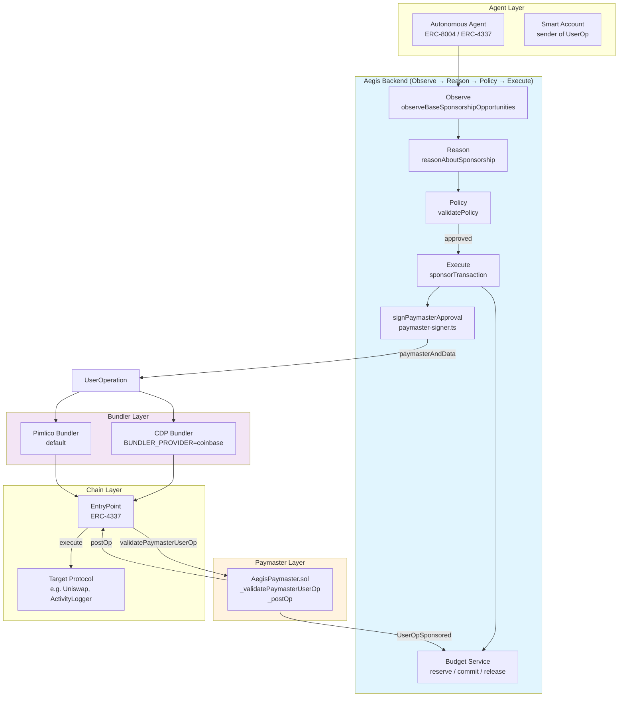
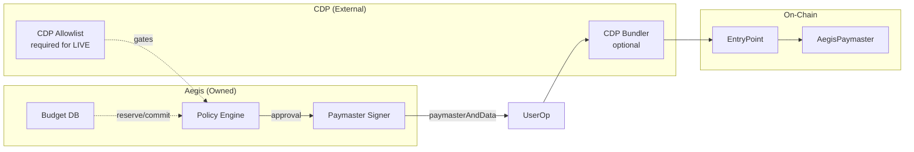
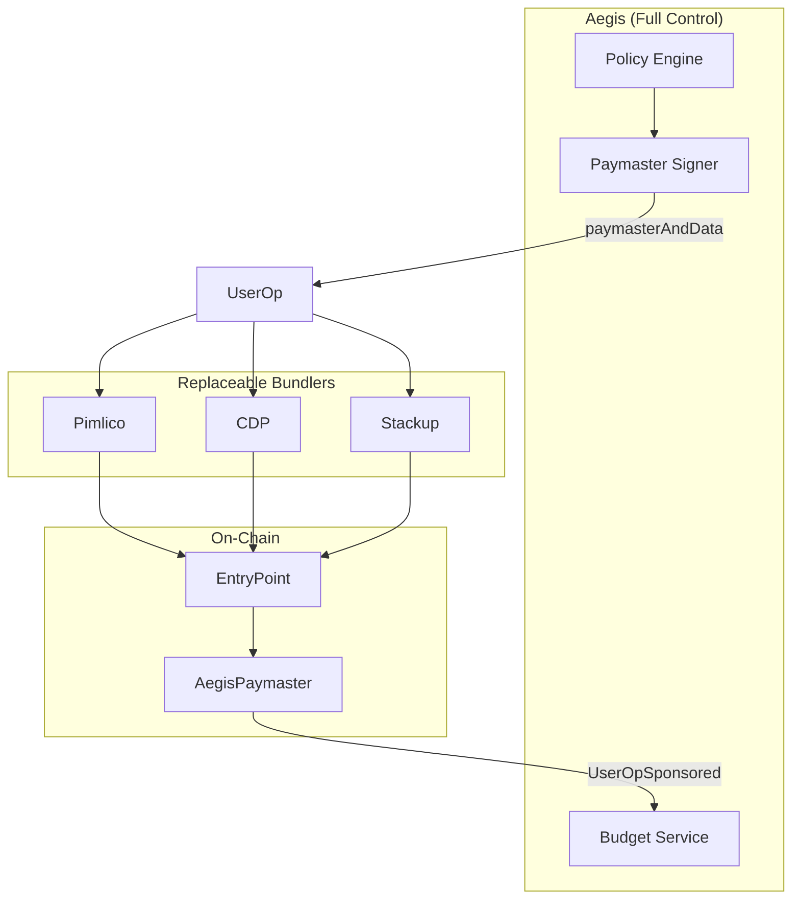
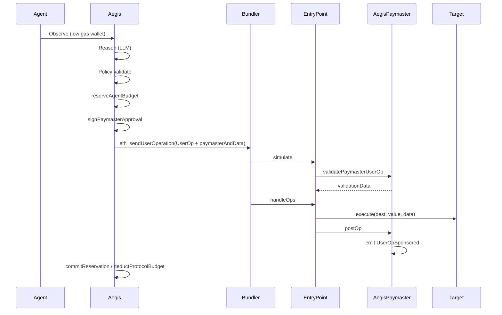

# Aegis Sponsorship System — Complete Architectural Breakdown

> **Senior Web3 Systems Architect Analysis**  
> Based on full codebase inspection of `aegis-agent` repository.

---

## 1. HIGH-LEVEL ARCHITECTURE

The Aegis sponsorship system is a layered ERC-4337 gas sponsorship protocol that orchestrates **Observe → Reason → Policy → Execute** to sponsor UserOperations for autonomous agents.

### Layer Stack (Top → Bottom)

| Layer | Responsibility | Ownership |
|-------|----------------|----------|
| **Agent Layer** | Autonomous agents (ERC-8004, ERC-4337 smart accounts) that request gas sponsorship | Protocol / User |
| **Wallet Layer** | ERC-4337 Smart Accounts (e.g. SimpleAccount, Coinbase Smart Wallet) — sender of UserOps | User |
| **Aegis Layer** | Policy engine, budget accounting, orchestration, decision signing | **Aegis** |
| **Paymaster Layer** | On-chain validation of sponsorship eligibility (AegisPaymaster.sol) | **Aegis** |
| **Bundler Layer** | UserOp bundling, simulation, inclusion (CDP or Pimlico) | **External** (replaceable) |
| **Chain Layer** | EntryPoint, execution, settlement | Base / Base Sepolia |

### Conceptual Flow

```
Agent (low gas) → Aegis observes → LLM reasons → Policy validates → Aegis signs paymaster approval
    → UserOp (with paymasterAndData) → Bundler → EntryPoint → AegisPaymaster validates
    → Execution (target protocol) → PostOp → UserOpSponsored event → Budget reconciled
```

---

## 2. MERMAID SYSTEM DIAGRAM



---

## 3. CURRENT STATE (CDP-DEPENDENT FLOW)

### How Aegis Uses CDP Today

| Role | CDP Involvement | Location |
|------|-----------------|----------|
| **Paymaster** | **None** — Aegis uses its own `AegisPaymaster.sol` | `contracts/AegisPaymaster.sol` |
| **Bundler** | **Optional** — CDP bundler when `BUNDLER_PROVIDER=coinbase` | `bundler-client.ts:71-78` |
| **Onboarding** | **Required for LIVE mode** — protocols need `cdpAllowlistStatus=APPROVED` | `onboarding.ts`, `canExecuteSponsorship` |

### CDP Bundler Selection

```typescript
// bundler-client.ts
export function getActiveBundlerRpcUrl(): string | undefined {
  const provider = (process.env.BUNDLER_PROVIDER ?? 'pimlico').toLowerCase();
  const coinbaseUrl = process.env.COINBASE_BUNDLER_RPC_URL?.trim();
  if (provider === 'coinbase' && coinbaseUrl) {
    return coinbaseUrl;  // CDP
  }
  return process.env.BUNDLER_RPC_URL ?? process.env.PAYMASTER_RPC_URL;  // Pimlico
}
```

### CDP Onboarding Lock-in

- **LIVE mode**: `onboardingStatus === 'LIVE'` AND `cdpAllowlistStatus === 'APPROVED'`
- **SIMULATION mode**: `onboardingStatus === 'APPROVED_SIMULATION'` and `simulationModeUntil` not expired
- Protocols must be submitted to CDP allowlist (`submitToCDPAllowlist`) and approved (`markCDPApproved`) to reach LIVE mode

### What Is Outsourced

- **Bundling**: CDP or Pimlico — UserOp submission, gas estimation, receipt polling
- **EntryPoint**: Standard ERC-4337 (v0.6 or v0.7)
- **CDP allowlist**: Manual batch process for protocol approval (not automated)

### Mermaid: Current CDP-Dependent Architecture



---

## 4. TARGET STATE (AEGIS PAYMASTER)

### How Aegis Functions With Its Own Paymaster

The system **already uses** Aegis-owned `AegisPaymaster.sol`. The target state from `architecture-revamp.md` is largely implemented:

| Component | Current | Target |
|-----------|---------|--------|
| Paymaster | AegisPaymaster.sol ✓ | Same |
| Policy | Off-chain, Aegis-owned ✓ | Same |
| Budget | Off-chain DB + event reconciliation ✓ | Same |
| Bundler | CDP or Pimlico (replaceable) ✓ | Same |
| Onboarding | CDP allowlist for LIVE | **Remove CDP dependency** |

### Changes in Control / Flow / Ownership

- **Control**: Aegis fully controls sponsorship policy via `signPaymasterApproval` (ECDSA over approval hash)
- **Flow**: Backend signs → Paymaster verifies on-chain → No external policy calls
- **Ownership**: Aegis owns `AEGIS_PAYMASTER_SIGNING_KEY` and `AEGIS_PAYMASTER_ADDRESS`

### Bundlers as Replaceable Execution Layers

- `IBundler` interface: `checkHealth`, `estimateGas`, `submit`, `waitForReceipt`, `submitAndWait`
- `DefaultBundlerAdapter` delegates to `bundler-client.ts`
- Swap bundler via `BUNDLER_PROVIDER` and corresponding RPC URL env vars

### Mermaid: Aegis-Owned Paymaster Architecture



---

## 5. SIDE-BY-SIDE COMPARISON

| Layer | CDP Model | Aegis Paymaster Model |
|-------|-----------|------------------------|
| **Paymaster** | CDP-provided paymaster (legacy) or Aegis-owned | AegisPaymaster.sol — Aegis-owned, backend-signed approvals |
| **Bundler** | CDP bundler (or Pimlico) | CDP, Pimlico, Stackup — pluggable via `BUNDLER_PROVIDER` |
| **Policy** | CDP allowlist + Aegis rules | Aegis-only: sponsorship rules, tier, budget, rate limits |
| **Budget** | CDP or Aegis | Aegis: ProtocolSponsor, AgentSpendLedger, reserve/commit/release |
| **Control** | CDP gates LIVE mode | Aegis controls policy; CDP allowlist optional for onboarding |

---

## 6. CODEBASE MAPPING

### Policy Engine

| File | Role |
|------|------|
| `src/lib/agent/policy/index.ts` | `validatePolicy` — main entry, composes rules + skills |
| `src/lib/agent/policy/rules.ts` | `validateRules`, `PolicyRule`, `RuleResult` |
| `src/lib/agent/policy/sponsorship-rules.ts` | `sponsorshipPolicyRules`, `validateSponsorshipPolicy` — protocol budget, rate limits, whitelist |
| `src/lib/agent/policy/tier-rules.ts` | `tierValidationRule`, `tierBudgetMultiplierRule` |
| `src/lib/agent/policy/skill-based-rules.ts` | `validateWithSkills` (when `SKILLS_ENFORCED=true`) |
| `src/lib/agent/policy/rate-limit-utils.ts` | `checkDailyCap`, `checkGlobalRate`, `checkProtocolRate` |

### Sponsorship Flow Logic

| File | Role |
|------|------|
| `src/lib/agent/index.ts` | `runSponsorshipCycle` — Observe → Reason → Policy → Execute |
| `src/lib/agent/execute/paymaster.ts` | `sponsorTransaction`, `preparePaymasterSponsorship`, `executePaymasterSponsorship`, `signDecision`, `deductProtocolBudget` |
| `src/lib/agent/execute/paymaster-signer.ts` | `signPaymasterApproval`, `computeApprovalHash`, `decodePaymasterAndData` |

### Paymaster Integration

| File | Role |
|------|------|
| `src/lib/agent/execute/paymaster.ts` | Full sponsorship flow, budget deduction, on-chain log |
| `src/lib/agent/execute/paymaster-signer.ts` | ECDSA approval for AegisPaymaster |
| `contracts/AegisPaymaster.sol` | `_validatePaymasterUserOp`, `_postOp`, `UserOpSponsored` event |
| `src/lib/agent/budget/event-listener.ts` | `startPostOpEventListener`, `handlePostOpEvent` — commits on `UserOpSponsored` |

### Bundler Integration

| File | Role |
|------|------|
| `src/lib/agent/execute/bundler-client.ts` | `getBundlerClient`, `getActiveBundlerRpcUrl`, `estimateUserOpGas`, `submitUserOperation`, `waitForUserOpReceipt`, `submitAndWaitForUserOp` |
| `src/lib/agent/execute/bundler/index.ts` | Re-exports `DefaultBundlerAdapter`, `createBundler` |
| `src/lib/agent/execute/bundler/default-adapter.ts` | `DefaultBundlerAdapter` — delegates to bundler-client |
| `src/lib/agent/execute/bundler/types.ts` | `IBundler`, `GasEstimate`, `UserOpReceipt` |
| `src/lib/agent/execute/bundler/factory.ts` | `createBundler()` |

### OpenClaw Command Interface

| File | Role |
|------|------|
| `src/lib/agent/openclaw/command-handler.ts` | `parseCommand`, `executeCommand` |
| `src/lib/agent/openclaw/session-manager.ts` | `createOpenClawSession`, `getSession`, `getProtocolIdFromSession` |
| `src/lib/agent/openclaw/commands/index.ts` | Command registration |
| `src/lib/agent/openclaw/commands/budget.ts` | Budget commands |
| `src/lib/agent/openclaw/commands/agent-crud.ts` | Agent CRUD |
| `src/lib/agent/openclaw/commands/protocol-crud.ts` | Protocol CRUD |
| `app/api/openclaw/route.ts` | POST `/api/openclaw` |

---

## 7. USEROP EXECUTION FLOW (LOW LEVEL)

### Step-by-Step Lifecycle

| Step | Action | Location |
|------|--------|----------|
| 1. **UserOp creation** | `buildExecuteCalldata` encodes `execute(target, value, data)` for smart account | `userop-calldata.ts` |
| 2. **Aegis observation** | `observeBaseSponsorshipOpportunities` — low gas wallets, protocol budget, agent reserves | `observe/sponsorship.ts` |
| 3. **Policy evaluation** | `validatePolicy` → `sponsorshipPolicyRules` (tier, budget, rate limits, whitelist, gas price) | `policy/index.ts`, `sponsorship-rules.ts` |
| 4. **Paymaster interaction** | `signPaymasterApproval` → `paymasterAndData` (validUntil, validAfter, agentTier, approvalHash, signature) | `paymaster-signer.ts` |
| 5. **Bundler submission** | `submitAndWaitForUserOp` → `eth_sendUserOperation` → `eth_getUserOperationReceipt` | `bundler-client.ts` |
| 6. **EntryPoint validation** | Bundler simulates → EntryPoint calls `validatePaymasterUserOp` on AegisPaymaster | `AegisPaymaster.sol` |
| 7. **Execution** | EntryPoint executes UserOp (account.execute → target protocol) | Chain |
| 8. **PostOp settlement** | `_postOp` emits `UserOpSponsored` → event-listener commits reservation; `deductProtocolBudget` | `event-listener.ts`, `paymaster.ts` |

### Sequence Diagram



---

## 8. EXTERNAL BUNDLER INTEGRATION

### Where Bundlers Are Called

| Function | File | Purpose |
|----------|------|---------|
| `getActiveBundlerRpcUrl` | `bundler-client.ts:71` | Resolve CDP vs Pimlico URL |
| `getBundlerClient` | `bundler-client.ts:101` | Create viem `BundlerClient` |
| `estimateUserOpGas` | `bundler-client.ts:201` | `eth_estimateUserOperationGas` |
| `submitUserOperation` | `bundler-client.ts:238` | `eth_sendUserOperation` |
| `waitForUserOpReceipt` | `bundler-client.ts:278` | `eth_getUserOperationReceipt` (polling) |
| `submitAndWaitForUserOp` | `bundler-client.ts:355` | Submit + wait (used by paymaster) |

### Abstraction

- `IBundler` interface in `bundler/types.ts` — `checkHealth`, `estimateGas`, `submit`, `waitForReceipt`, `submitAndWait`
- `DefaultBundlerAdapter` implements `IBundler` and delegates to `bundler-client`
- To plug a new bundler: implement `IBundler` and wire via factory or env

### Multiple Bundlers

- Single active bundler per env (`BUNDLER_PROVIDER` + URL)
- No built-in failover; circuit breaker uses `checkBundlerHealth` before execution

---

## 9. ARCHITECTURAL GAPS

### Current Weaknesses

| Gap | Description |
|-----|-------------|
| **CDP onboarding lock-in** | LIVE mode requires `cdpAllowlistStatus=APPROVED` — manual batch, 5–7 day wait |
| **Single bundler** | No automatic failover; one bundler per deployment |
| **Budget race conditions** | Reserve/commit/release + event-listener can have edge cases on restart |
| **Gas price source** | `GAS_PRICE_WEI` env fallback; actual gas from receipt may differ |

### CDP Lock-in Points

| Location | Lock-in |
|----------|---------|
| `onboarding.ts:canExecuteSponsorship` | `cdpAllowlistStatus === 'APPROVED'` required for LIVE |
| `onboarding.ts:submitToCDPAllowlist` | Manual batch submission |
| `onboarding.ts:markCDPApproved` | Manual approval step |
| `protocol-service.ts` | `CDPStatus` enum in ProtocolSponsor |

### Scaling Bottlenecks

- Rate limits: `MAX_SPONSORSHIPS_PER_MINUTE`, `MAX_SPONSORSHIPS_PER_PROTOCOL_MINUTE`, `MAX_SPONSORSHIPS_PER_USER_DAY`
- Per-agent budget: `AgentSpendLedger` with RESERVED/COMMITTED/RELEASED
- Event listener: single watcher per AegisPaymaster

### Missing Abstraction Layers

- No formal bundler failover / load balancing
- No multi-chain paymaster registry (single chain per deployment)
- Protocol whitelist is DB-driven; no on-chain allowlist for AegisPaymaster

---

## 10. QUICK REFERENCE

### Key Environment Variables

| Variable | Purpose |
|----------|---------|
| `BUNDLER_PROVIDER` | `coinbase` or `pimlico` |
| `COINBASE_BUNDLER_RPC_URL` | CDP bundler RPC |
| `BUNDLER_RPC_URL` / `PAYMASTER_RPC_URL` | Pimlico RPC |
| `AEGIS_PAYMASTER_ADDRESS` | AegisPaymaster contract |
| `AEGIS_PAYMASTER_SIGNING_KEY` | Backend ECDSA key |
| `ENTRY_POINT_ADDRESS` | v0.6 or v0.7 EntryPoint |

### Key Contracts

| Contract | Role |
|----------|------|
| `AegisPaymaster.sol` | Validates paymasterAndData, emits UserOpSponsored |
| `AegisActivityLogger` | Optional on-chain log for sponsorship (ping) |

### Entry Points

| Flow | Entry |
|------|-------|
| Sponsorship cycle | `runSponsorshipCycle` in `agent/index.ts` |
| OpenClaw | `POST /api/openclaw` → `command-handler.ts` |
| Paymaster execution | `sponsorTransaction` in `execute/paymaster.ts` |

---

*Document generated from codebase analysis. Last updated: 2025-03-19.*
