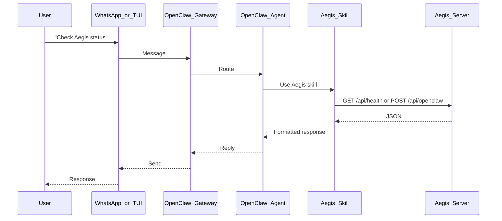

# OpenClaw + Aegis Integration

This document describes how OpenClaw connects to Aegis, how to configure identity and skills, and how to run and test the full stack (TUI, WhatsApp, curl).

## What is OpenClaw?

OpenClaw is a gateway that connects AI agents to messaging channels (WhatsApp, Telegram, Signal, etc.) and to a local TUI. The main agent runs Claude and can use **skills** (e.g. the Aegis skill) to call external APIs. When you say "Check Aegis status" in the TUI or on WhatsApp, the agent uses the Aegis skill to call the Aegis HTTP API and returns the result.

## Architecture



- **OpenClaw Gateway**: Runs as a daemon (e.g. LaunchAgent on macOS), port 18789 by default.
- **OpenClaw Agent**: Main Claude session; reads identity (IDENTITY.md, SOUL.md) and skills from `~/.openclaw/workspace/`.
- **Aegis Skill**: Lives in `~/.openclaw/workspace/skills/aegis/`; provides SKILL.md and scripts that call Aegis.
- **Aegis Server**: Next.js app; exposes `/api/health`, `/api/openclaw` (GET manifest, POST commands).

## Identity Configuration

The agent’s identity is defined in the OpenClaw workspace so it knows it **is** Aegis and how to behave.

| File | Purpose |
|------|---------|
| `~/.openclaw/workspace/IDENTITY.md` | Name (Aegis), creature, vibe, emoji. |
| `~/.openclaw/workspace/SOUL.md` | Core behavior: call Aegis API for status/report, voice, boundaries. |
| `~/.openclaw/workspace/USER.md` | Operator name, timezone, context. |

After editing these, restart the gateway so the agent picks them up:

```bash
openclaw gateway restart
```

## Skill Installation

The Aegis skill is installed under the OpenClaw workspace:

```bash
# From repo root (aegis-agent)
cp -r aegis-agent/openclaw-skills-PR-ready/aegis ~/.openclaw/workspace/skills/aegis
```

Contents:

- `SKILL.md` — API overview, commands, examples.
- `scripts/aegis-health.sh` — Health check using `AEGIS_URL`.
- `scripts/aegis-sponsor.sh` — Sponsorship helpers.
- `references/api-reference.md`, `references/integration-guide.md`.

### Environment Variables for the Skill

Set in `~/.openclaw/workspace/.env` (or your shell when running scripts):

- **AEGIS_URL** — Base URL of the Aegis app (e.g. `http://localhost:3000` for dev, or your Vercel URL).
- **AEGIS_API_KEY** — Optional; required for `POST /api/openclaw` when not in development.

Example `~/.openclaw/workspace/.env`:

```bash
AEGIS_URL=http://localhost:3000
# AEGIS_API_KEY=your-key-from-aegis-agent-env
```

## Channel configuration (Telegram only, etc.)

**Do we update it from the CLI?** OpenClaw’s CLI can read config (e.g. `openclaw config get gateway.auth.token`). Whether it can **set** channel options depends on the OpenClaw version: run `openclaw config --help` or `openclaw config set --help` to see if there are commands for enabling/disabling channels (e.g. Telegram vs WhatsApp).

**If the CLI doesn’t support channel toggles**, edit the config file and restart the gateway:

1. Open `~/.openclaw/openclaw.json`.
2. Enable only the channels you want (e.g. set or keep `channels.telegram` enabled and disable or remove `channels.whatsapp` according to OpenClaw’s schema).
3. Restart so changes apply:
   ```bash
   openclaw gateway restart
   ```

Aegis is channel-agnostic; no Aegis code or env changes are required to use Telegram only.

## How to Invoke Aegis

There is **no** `openclaw send aegis "status"` CLI command. Use one of these:

### 1. OpenClaw TUI (natural language)

In the TUI (`openclaw tui`), type for example:

- "Check Aegis health"
- "What's Aegis status?"
- "Show Aegis report"

The agent uses the Aegis skill to call the Aegis API and replies with the result.

### 2. WhatsApp

If OpenClaw is linked to WhatsApp, send the same kind of messages (e.g. "Check Aegis status"). The agent responds the same way.

### 3. Direct curl (no OpenClaw)

When the Aegis server is running:

```bash
# Manifest (no auth)
curl -s http://localhost:3000/api/openclaw | jq .

# Health (no auth)
curl -s http://localhost:3000/api/health | jq .

# Command (auth required unless NODE_ENV=development)
curl -s -X POST http://localhost:3000/api/openclaw \
  -H "Authorization: Bearer $AEGIS_API_KEY" \
  -H "Content-Type: application/json" \
  -d '{"command": "status", "sessionId": "cli-1"}' | jq .
```

Commands: `status`, `cycle`, `sponsor`, `report`, `pause`, `resume`, `help` (see GET /api/openclaw for the full list).

## Starting the Stack

### Development

1. **Start Aegis** (Next.js):

   ```bash
   cd aegis-agent
   npm run dev
   ```

   Default: http://localhost:3000 (or next free port if 3000 is in use).

2. **Ensure OpenClaw gateway is running**:

   ```bash
   openclaw status
   openclaw gateway restart   # if needed
   ```

3. **Open TUI or use WhatsApp**:

   ```bash
   openclaw tui
   ```

### Production

- Run Aegis in production (e.g. Vercel) and set `AEGIS_URL` (and `AEGIS_API_KEY`) in the OpenClaw workspace or environment accordingly.
- Keep the gateway running (LaunchAgent / systemd) and the same identity/skill setup.

## Environment Variables (Summary)

| Variable | Where | Purpose |
|----------|--------|---------|
| AEGIS_URL | ~/.openclaw/workspace/.env or shell | Base URL for Aegis (skill scripts and agent). |
| AEGIS_API_KEY | aegis-agent .env.local / OpenClaw env | Auth for POST /api/openclaw (optional in dev). |

Aegis server uses `AEGIS_API_KEY` in its own env to validate `Authorization: Bearer` on POST /api/openclaw.

## Troubleshooting

### "Pairing required" (gateway / CLI)

- The gateway stores paired devices in `~/.openclaw/devices/paired.json` (not `nodes/`).
- Open the dashboard (http://127.0.0.1:18789/), authenticate with the gateway token, and approve any pending device in the Devices/Pairing section.
- Gateway token: from `~/.openclaw/openclaw.json` under `gateway.auth.token`, or `openclaw config get gateway.auth.token` if the CLI can connect.

### "No trace of Aegis" / agent doesn’t know Aegis

- Ensure the Aegis skill is installed: `~/.openclaw/workspace/skills/aegis/SKILL.md`.
- Ensure identity is set: IDENTITY.md and SOUL.md describe you as Aegis and tell the agent to use the Aegis skill for status/report.
- Restart the gateway after changing identity or skills: `openclaw gateway restart`.

### Aegis server not responding

- Confirm the app is running: `curl -s http://localhost:3000/api/health`.
- If using a different port (e.g. 3001), set `AEGIS_URL` to that base URL.

### POST /api/openclaw returns 401

- In development, the route allows requests when `AEGIS_API_KEY` is unset and `NODE_ENV === 'development'`.
- Otherwise, send `Authorization: Bearer <AEGIS_API_KEY>` with the same value as in the Aegis server env.

### Security warnings (credentials dir)

- Restrict the credentials directory: `chmod 700 ~/.openclaw/credentials`.

### No response when messaging from another number

OpenClaw’s WhatsApp channel uses an **allowlist**: only numbers in `channels.whatsapp.allowFrom` are accepted. Messages from any other number are ignored, so you get no reply.

**Fix — allow specific numbers**

1. Open `~/.openclaw/openclaw.json`.
2. Find `channels.whatsapp.allowFrom`. It will look like: `"allowFrom": ["+2347067234836"]`.
3. Add the other number(s) in E.164 format (e.g. `+15551234567`):
   ```json
   "allowFrom": ["+2347067234836", "+15551234567"]
   ```
4. Save the file and restart the gateway:
   ```bash
   openclaw gateway restart
   ```
5. Send a message again from that number; the agent should reply.

**Alternative — allow new numbers via pairing**

To let unknown numbers request access and then approve them:

1. In `~/.openclaw/openclaw.json`, set `"dmPolicy": "pairing"` (instead of `"allowlist"`).
2. Restart the gateway. New senders will receive a one-time pairing code.
3. Approve them via the dashboard (http://127.0.0.1:18789/) or CLI: `openclaw pairing list whatsapp`, then `openclaw pairing approve whatsapp <CODE>`.

**Allow all senders (least secure)**

Only if you want any number to message the bot:

- Set `"dmPolicy": "open"` and `"allowFrom": ["*"]`. Restart the gateway.

## Available Aegis Commands (POST /api/openclaw)

| Command | Effect |
|---------|--------|
| status | Reserve health, ETH/USDC balances, runway |
| cycle | Trigger one sponsorship cycle |
| sponsor \<wallet\> \<protocol\> | Manually queue a sponsorship |
| report | Last 20 activity log entries |
| pause | Pause the autonomous loop |
| resume | Resume the autonomous loop |
| help | List all commands |

Natural-language variants (e.g. "pause for 2 hours", "set budget to $500") are handled by the command parser in `src/lib/agent/openclaw/command-handler.ts` and related modules.

## Key Repo Files

| File | Purpose |
|------|---------|
| `app/api/openclaw/route.ts` | HTTP bridge: GET manifest, POST command. |
| `src/lib/agent/openclaw/command-handler.ts` | Parse and execute OpenClaw commands. |
| `src/lib/agent/openclaw/session-manager.ts` | Session/protocol mapping. |
| `src/lib/agent/openclaw/proactive-reporter.ts` | Callback URL notifications. |
| `openclaw-skills-PR-ready/aegis/` | Aegis skill (SKILL.md + scripts + references). |

## References

- OpenClaw: https://docs.openclaw.ai
- Aegis agent card: `GET $AEGIS_URL/.well-known/agent-card.json`
- Aegis API: `references/api-reference.md` and `references/integration-guide.md` in the Aegis skill directory.
